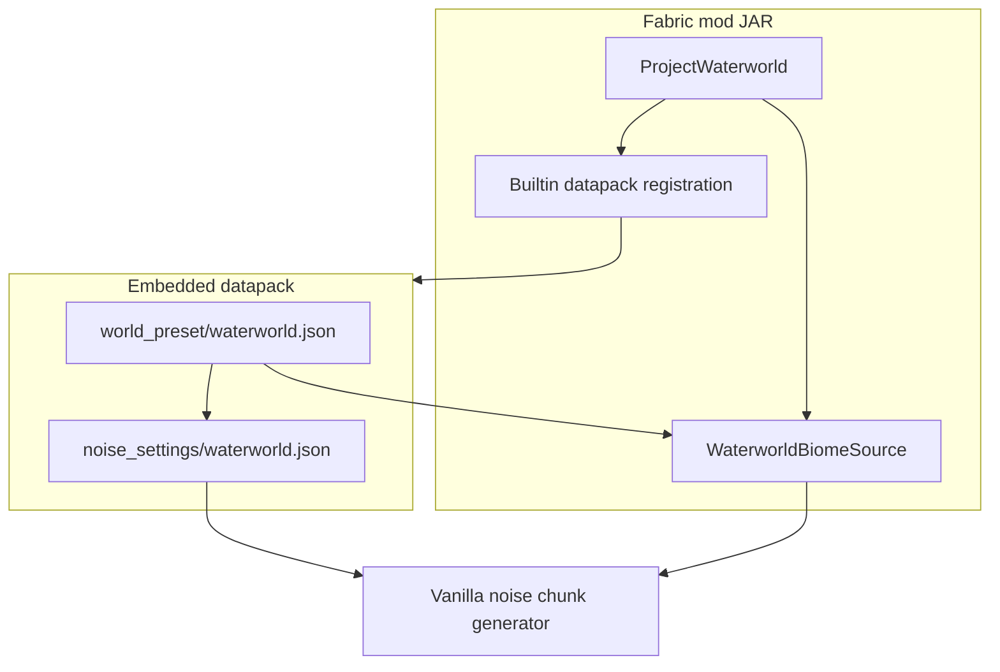

# Architecture

## Overview

## Responsibilities

| Component | Owns |
|-----------|------|
| **Datapack** (`data/project-waterworld/`) | World preset, noise settings (sea level, density caps, surface rules), UI tag for normal presets |
| **Mod Java** | `WaterworldBiomeSource` codec, builtin pack registration |
| **Vanilla** | Chunk noise, aquifers, ore, carving (tuned via JSON) |

## Biome selection

[`WaterworldBiomeSource`](../src/main/java/waterworld/worldgen/WaterworldBiomeSource.java) delegates to two vanilla `MultiNoiseBiomeSource` instances:

- **`land`** — preset `minecraft:overworld` when block Y **> 112**
- **`underwater`** — custom ocean + cave parameter list when block Y **≤ 112**

Same (x,z) climate noise drives both; only the vertical threshold and biome list change.

## Terrain

[`noise_settings/waterworld.json`](../src/main/resources/data/project-waterworld/worldgen/noise_settings/waterworld.json):

- `sea_level`: **112**
- `final_density`: capped so no solids at/above surface; seabed ceiling gradient (~Y 76)
- Surface rules: vanilla ocean-floor materials underwater

## Versioning

See [VERSIONS.md](VERSIONS.md) for the full matrix and upgrade procedure. Summary: Minecraft **26.1.2**, Mojang mappings (no Yarn), Loom **1.16**, Gradle **9.4**, Java **25**.
