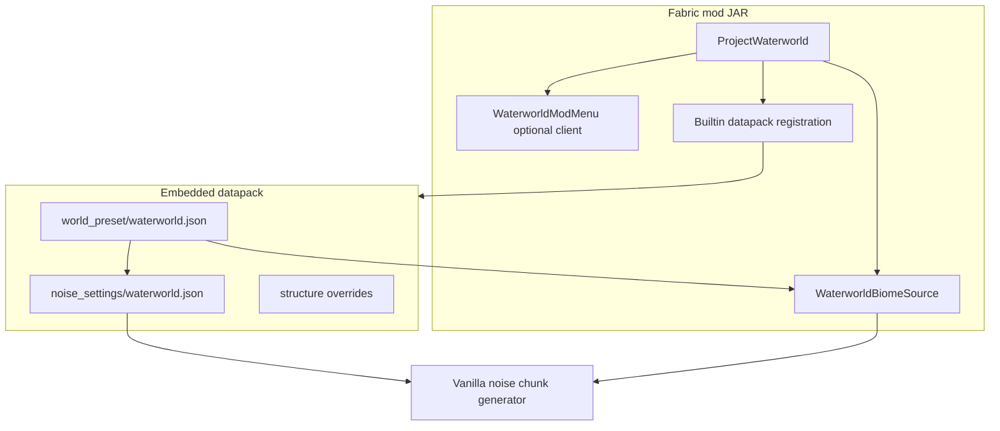

# Architecture

## Overview

## Responsibilities

| Component | Owns |
|-----------|------|
| **Datapack** (`data/project-waterworld/`) | World preset, noise settings (sea level, density caps, surface rules), UI tag for normal presets |
| **Datapack overrides** (`data/minecraft/`) | Buried-treasure biome gate (`#minecraft:is_ocean`); empty trail-ruins structure set |
| **Mod Java** | `WaterworldBiomeSource` codec, builtin pack registration, mob/spawn mixins, optional Mod Menu client entrypoint |
| **Mod Java (client, optional)** | `WaterworldModMenu` + `WaterworldConfigScreen` — in-game config when Mod Menu is installed (`compileOnly` dependency; no runtime requirement) |
| **Vanilla** | Chunk noise, aquifers, ore, carving (tuned via JSON) |

## Biome selection

[`WaterworldBiomeSource`](../src/main/java/waterworld/worldgen/WaterworldBiomeSource.java) wraps a single vanilla `MultiNoiseBiomeSource` (overworld preset). At each noise position it **samples vanilla first** and **substitutes only when the layer demands it** — same (x, z) climate noise as vanilla; vertical layer and tag classification decide whether the sample is kept or remapped.

### Layers

| Layer | Block Y | Rule |
|-------|---------|------|
| **Surface** | ≥ sea level − 4 (fuzz buffer) | Keep land, coast, river, and mushroom-field biomes verbatim. Replace only **ocean-tagged** biomes with a climate-matched inland biome (continentalness raised to −0.10; other climate params preserved). |
| **Underwater** | &lt; sea level − 4 | Keep ocean, cave, and underground biomes verbatim. Replace vanilla **land** columns with a climate-matched **non-deep** ocean biome (continentalness clamped to [−0.45, −0.20]) so monuments and deep-ocean spawns stay out of columns that are land in the vanilla seed. Genuine vanilla oceans keep their deep variants. |

Sea level is **112** ([`WaterworldConstants.SEA_LEVEL`](../src/main/java/waterworld/WaterworldConstants.java)).

### Fuzz buffer (intentional — do not remove)

Biome noise is fuzzed by up to one quart (4 blocks). The constant `BIOME_FUZZ_BUFFER = 4` treats block Y **108–111** (the top water quart) as part of the **surface layer**, not the underwater layer. Everything at and just below sea level therefore resolves to the **surface biome** for rendering.

**Why:** Water tint, fog, and sky at Y=112 while swimming or boating match the surface biome (beach, river mouth, etc.) instead of the underwater ocean biome. Removing or shrinking this buffer would “fix” a visual mismatch that is deliberate.

### Tag-driven classification

Ocean: `minecraft:is_ocean`, `c:is_ocean`, `c:is_deep_ocean`. Cave/underground: `c:is_cave`, `c:is_underground`. Future vanilla and modded biomes with correct tags are handled without code changes.

### Modded biome compatibility

| Approach | Compatibility |
|----------|----------------|
| Mods that **inject into the vanilla multi-noise parameter space** (add biomes to the overworld preset with standard tags) | **Works** — picked up by the wrapped overworld source and tag rules |
| Mods that **replace the biome source** entirely (e.g. TerraBlender-style custom sources) | **Out of scope** — they bypass this world preset |

## Terrain

[`noise_settings/waterworld.json`](../src/main/resources/data/project-waterworld/worldgen/noise_settings/waterworld.json):

- `sea_level`: **112**
- `final_density`: capped so no solids at/above surface; seabed ceiling gradient (~Y 76)
- Surface rules: vanilla ocean-floor materials underwater

## Versioning

See [VERSIONS.md](VERSIONS.md) for the full matrix and upgrade procedure. Summary: Minecraft **26.2**, Mojang mappings (no Yarn), Loom **1.17**, Gradle **9.5.1**, Java **25**.
